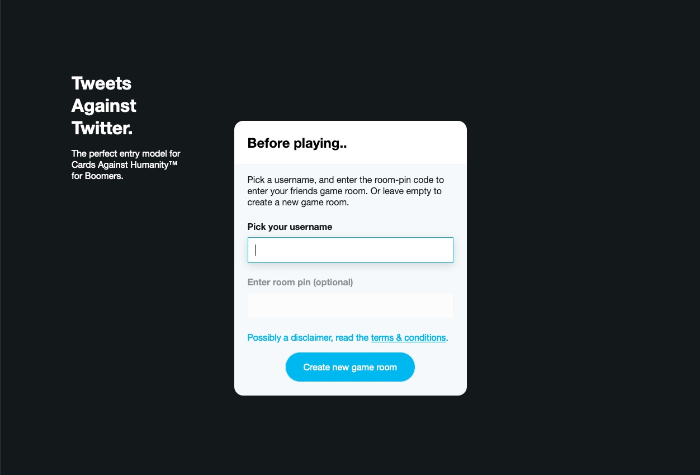

# Cards Against Humanity

### Table of contents

- [Introduction](#introduction)
- [Installation](#installation)
- [To do's](#to-dos)
- [Data & Events](#data-events)
    - [Data lifecycle](#dlc)
    - [Events](#events)
- [Technologies used](#technologies-used)
- [License](#license)

## Introduction

I wanted to test creating a game. This is digital version of [Cards Against Humanity.](https://cardsagainsthumanity.com/).
Create your own game room, invite your friends and play together!

_Sorry still WIP, not fully playable yet_

## Installation

Go to the directory where you want to install this. Next copy & paste this line in your terminal.

```bash
git clone https://github.com/gijslaarman/real-time-web-1920.git && cd real-time-web-1920 && npm install
```

Almost ready to go.

This server uses a mongodb server, so instert a mongodb uri.
Create a .env file, paste your db_uri here. See docs of mongodb or your database provider.

```bash
echo 'db_uri="<your_db_uri>"' > /.env
```

\- or -

Create a '.env' file (without quotes). And add manually:

```bash
db_uri="<your_db_uri>"
```

---

NPM scripts

```bash
# Start: starts up an instance of node.
npm run start

# Dev: watch for changes.
npm run dev

# ⚠️ Coming soon
# Build database, DOES NOT WORK YET
npm run build-db
```

## To do's

Technical:

-   [x] Create a room system, with a pin as passwords.
-   [x] Populated database with 450 "black" cards & 1600 "white" cards.
-   [x] Room & User class to store & mutate the room's data.
-   [x] Handle users joining & leaving.
-   [x] Distribute cards among players.
-   [x] Split up clientside javascript into different managers to make feature creation easier.

Game features:

-   [x] User can join/leave without crashing.
-   [x] User can create their own room.
    -   [ ] User can setup their room from a selection of options to their liking.
-   [x] Players who need to pick a card can pick click the card they want to play.
-   [x] Cards played are anonymous until they need to be shown.
-   [x] When everyone played their card the cards turn.
-   [x] Winning card rewards it's player one point.
-   [ ] If someone played a card, remove it from their inventory and draw a new card from the games deck.
-   [ ] Have only the picker choose what the winning card is (currently everyone can choose).
-   [ ] Rewrite the round working system so it can be recycled for the next rounds as well.
-   [ ] Support for more than 1 pick (support for black cards with 2 or 3 empty spots).

## Data & Events
<div id="dlc"></div>


Cached data on the server:

##### Rooms

```javascript
// Example of a room stored. They are all stored in a global object
// and added by their room pin name, '4etuV' in this case.
{
  '4etuV': Room {
    pin: '4etuV', // Rooms pin
    persons: 2, // Amount of persons joined
    joined: [ 'YW1gh7Qapw9Czgb2AAAB', 'dLZ9Ay1HmYTI2JNnAAAC' ], // The users joined.
    deck: { // This rooms carddeck, These cards are also stored like this on the DB.
        blackCards: [
            {
                _id: '5eafde3022fc4643bb64353f',
                pick: 1, // The amount of cards that need to be picked.
                text: 'The doctor would be woefully incomplete without ___.'
            } // Etc etc.. filled with cards.
        ],
        whiteCards: [
            {
                _id: '5eafde3022fc4643bb64353f',
                text: 'A hammer'
                // Etc etc.. filled with cards.
            }
        ]
    },
    // The user will only see the card 'id' that's why we store all the other data server side.
    playfield: [
        {
            _id: '5eafde3022fc4643bb64353f',
            text: 'The way white people is.',
            id: 'AN833X59hK',
            from_player: 'dLZ9Ay1HmYTI2JNnAAAC'
        }
    ],
    in_play: false, // Are we still waiting?
    whos_turn: 0, // index of which players turn it is. For if someone joins midgame the index has no problem.
    YW1gh7Qapw9Czgb2AAAB: { // User object of this player, for easy access.
      UUID: 'YW1gh7Qapw9Czgb2AAAB',
      username: 'Gijs',
      handle: 'percussioncharacteristic',
      cards: [Array],
      points: 0,
      is_host: true
    },
    dLZ9Ay1HmYTI2JNnAAAC: {
      UUID: 'dLZ9Ay1HmYTI2JNnAAAC',
      username: 'Test persoon',
      handle: 'testerrecommended',
      cards: [Array],
      points: 0,
      is_host: false
    }
  }
}
```

#### allUsers

```javascript
// allUsers object to store the data of each player, and what room they are in.
{
YW1gh7Qapw9Czgb2AAAB: { // User object of this player, for easy access.
        user: {
            UUID: 'YW1gh7Qapw9Czgb2AAAB',
            username: 'Gijs',
            handle: 'percussioncharacteristic',
            is_host: true
        },
        room: '4etuV'
    },
dLZ9Ay1HmYTI2JNnAAAC: {
        user: {
            UUID: 'dLZ9Ay1HmYTI2JNnAAAC',
            username: 'Test persoon',
            handle: 'testerrecommended',
            is_host: false
        },
        room: '4etuV'
    }
}

```

### Events
How the game communicates.

#### Before play
**1. A player creates a room.**


```
# Event: 'create room'
Tells the server to create a room, get some cards from the database and prepare the game.

# Event: 'setup'
Tell the users client to build up the gameroom.
```



2. He shares the room pin code, by copying the code/the link or telling them. (top right it's visisble.)
```
# Event: 'join room'
Tell the server that you want to join this room. So create a player & add him to the cached room.

# Event: 'joining room'
Send this back to the client of the user that's joining to make up the gameroom with it's details (players & state). 
And populate their cards.

# Event: 'user joined'
Send this back to the users already in the room that a new user has joined.

<!-- What if the user leaves? -->
# Event: 'user left'
On disconnect from the server send this event to all the other users in that room to handle the removal of this users' data.
```


3. Starting the game
```
# Event: 'start game'
Once the host clicks start game (button is only visible to him). 
The server will check if there are enough players in the room to start the game.
If not the Host will get a message saying: Not enough players.
If there are enough players the server will send back an event 'start game' to everyone.

# Event: 'start game' (client side)
GameManager handler will operate to setup the game, and recieve the first 'blackcard' from the server.
If the server assigned you the first picker (the one who chooses the winner) you won't be able to pick 
a card from the left side so it will be blacked out. 

The cardManager will handle the creation of the top card/black card to be filled with the data.
```


4. Playing the game
```
# 1. Event: 'pick a card'
The users who need to pick a card will recieve this event, this enables them to 
be able to pick a card from the left side.

# 2. Event: 'player played card'
The player picked a card to play. Emit this action for every user, send the card 
to the playfield without the text content but with its own unique id to know for later.
(this is done so that the user can't cheat with inspect element).

# 3. Event: 'flip the cards'
If a user plays the last card to play ask the server to fill the card data with the content. 
The cards will flip over and the picker is allowed to choose a card.

# 4. Event: 'winner chosen'
The picker chose a card and tells the server what card he picked. The server will correspond 
the card id with the user and award him/her a point.

There will be an overlay over the page with the message of who won and a button to start the next round.

5. Event: 'start round'
Start next round, WIP :(.
```


## Technologies used

* 🛠 [socket.io](https://socket.io/) for the sockets.
* 🛠 [expressjs](https://expressjs.com) serverside.
* 🛠 [Cards Against Humanity. API](https://cards-against-humanity-api.herokuapp.com/sets/) (for the cards).

## License 
🔓 See the [LICENSE file](https://github.com/gijslaarman/real-time-web-1920/blob/master/LICENSE) for license rights and limitations (MIT).

<style>
    code {
    white-space : pre-wrap !important;
    }
</style>